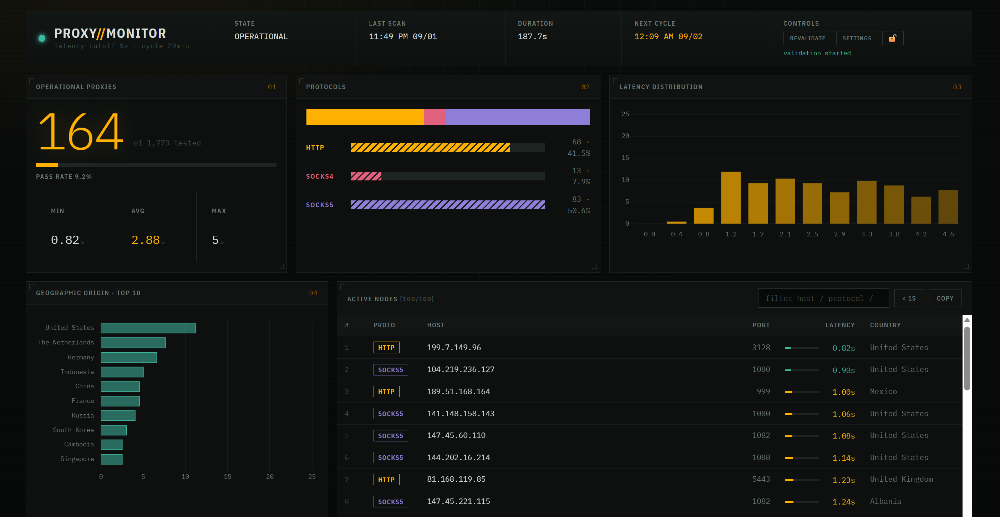

# PROXY//MONITOR

Downloads free proxy lists, checks which ones actually work, and serves the
survivors over HTTP — with a live dashboard on top.


Runs with zero configuration: `docker compose up` and open `http://localhost:8069`.

## Why validate over HTTPS

Most proxy checkers fetch an `http://` URL and call it a day. That does not
exercise the `CONNECT` method — the request goes out in absolute-URI form and
any transparent cache can answer it. Real traffic is HTTPS, which requires the
proxy to open a tunnel.

Measured on one run of 652 proxies:

| Test method | Passed | |
|---|---|---|
| Plain HTTP | 174 | 26.7% |
| HTTPS via `CONNECT` | **70** | 10.7% |

The difference were **false positives** — proxies that look alive and cannot
carry the traffic anyone actually wants to send. The list this produces is
smaller and usable. `--test-http` on the CLI reproduces the weaker check if you
want to compare.

Latency is measured with `perf_counter` around the whole request, so it includes
the TCP connection and the proxy handshake — the expensive part that
`response.elapsed` leaves out.

## Dashboard

`http://localhost:8069` — refreshes every 30s, reading `/api/stats`.

Shows accepted vs. tested, pass rate, min/avg/max latency, protocol split, a
latency histogram computed server-side over **every** valid proxy (not just the
ones on screen, which would skew it toward the fast end), top 10 countries, and
a filterable table of the fastest nodes.

Available in **English and Portuguese**, switchable from the settings panel. The
browser's `Accept-Language` is the initial guess; an explicit choice is
remembered in a cookie.

**Viewing is open; changing anything needs a login.** The buttons start locked —
click the padlock and enter the dashboard password, initially `admin` and
changeable from the panel itself. Clicking the padlock again ends the session.

The session is a **signed, HttpOnly cookie**: no credential is kept anywhere a
script on the page could read it. The API key never reaches the browser — it
stays what it should be, a machine credential for scripts.



### Settings panel

Eight settings editable at runtime, grouped into Proxy sources, Validation,
Geolocation and Dashboard. Each shows what it changes, the accepted range, the
default and the environment variable it comes from.

**Proxy sources are editable from the panel** — add, remove and reorder the URLs
without a redeploy. Each row has a **test** button that fetches the URL and
reports how many proxies it yields, broken down by protocol, before you save.
Adding a source blind otherwise means waiting a whole cycle to discover it
returns nothing, or HTML, or a format the parser does not recognize.

A source must return plain text, one proxy per line, as `ip:port` or
`protocol://ip:port`. When the URL carries a `protocol=` parameter it is used
for lines with no scheme.

**Sources cannot point at your own network.** Only `http`/`https` URLs are
accepted, and hostnames resolving to loopback, RFC1918, link-local or reserved
addresses are refused. Without that, anyone who can log into the dashboard could
use the server to probe hosts only it can reach — a router, an unauthenticated
admin panel, or `169.254.169.254`, the cloud metadata endpoint that hands out
credentials. The three possible answers (responded, connection refused, timed
out) are enough to map a private network.

Set `ALLOW_INTERNAL_SOURCES=true` when you genuinely host your proxy list on the
same private network.

The schema lives in `settings.py` and is served by `GET /api/settings`, so the
UI builds its form from it — **adding a setting in Python makes it appear on
screen** with no HTML change. Text lives in `i18n.py`, so adding a language
never touches the schema.

- Overrides **beat the environment variable** and persist in the data volume.
  Turning something off because of a problem and watching it revert on the next
  deploy would be the worst possible surprise.
- A batch is **all or nothing**: one invalid value rejects the whole set, so the
  configuration never lands in a half-state.
- Settings tagged `next cycle` only take effect on the following validation. The
  interval is the exception — the scheduler re-reads it each pass, so changing
  it needs no restart.

## Endpoints

| Endpoint | Auth | Description |
|---|:---:|---|
| `GET /` | — | Dashboard |
| `GET /health` | — | Health check plus validator diagnostics |
| `GET /api/stats` | — | Aggregate metrics and the fastest proxies |
| `GET /api/auth` | — | Session state |
| `POST /api/login` | — | `{"password": "..."}` opens a session |
| `GET /proxy/all` | 🔑 | Full list as JSON |
| `GET /proxy/all.txt` | 🔑 | Same list in plain text, one per line |
| `POST /api/refresh` | 🔑 | Revalidate now (`202`, or `409` if already running) |
| `POST /api/logout` | 🔑 | End the session |
| `POST /api/password` | 🔑 | `{"current": "...", "new": "..."}` |
| `GET /api/settings` | 🔑 | Schema and current values, localized |
| `POST /api/settings` | 🔑 | Apply a batch |
| `POST /api/settings/reset` | 🔑 | Reset one (`{"key": "..."}`) or all |
| `POST /api/settings/test-source` | 🔑 | `{"url": "..."}` fetches a source and reports what it yields |

🔑 = a dashboard **session** or the `X-API-Key` header. With
`PUBLIC_DASHBOARD=false`, `/` and `/api/stats` require credentials too.

**Filtering by protocol:** `?types=http,https,socks5` on either list endpoint.
Useful because plenty of tools reject SOCKS4.

**List token:** consumers that can only fetch a URL — subscription-style
integrations that send no headers — can use `?token=<LIST_TOKEN>` on
`/proxy/all.txt`. It is deliberately separate from `API_KEY`: a query string
shows up in access logs, and the worst a leak buys is reading a proxy list the
dashboard already displays.

```bash
curl -H "X-API-Key: YOUR_KEY" http://localhost:8069/proxy/all
curl "http://localhost:8069/proxy/all.txt?types=socks5&token=YOUR_LIST_TOKEN"
```

## Configuration

Everything is optional — the service runs unconfigured. Copy `.env.example` to
`.env` as a starting point.

| Variable | Default | Description |
|---|---|---|
| `API_KEY` | *(generated)* | Machine credential. Unset generates one on first boot and prints it once |
| `LIST_TOKEN` | *(empty)* | Read-only token for `?token=` on the text list |
| `INTERVAL_SECONDS` | `1200` | Seconds between full revalidations |
| `MAX_LATENCY_SECONDS` | `5.0` | Health cutoff |
| `VALIDATOR_WORKERS` | `100` | Concurrent validation threads |
| `PROXY_SOURCES` | *(built-in)* | Initial source list, comma or newline separated. The panel overrides it |
| `ALLOW_INTERNAL_SOURCES` | `false` | `true` permits sources on private/loopback addresses |
| `GEOLOOKUP` | `true` | Country lookups through ip-api.com |
| `GEOLOOKUP_MAX_IPS` | `500` | Cap on **new** IPs resolved per cycle |
| `PUBLIC_DASHBOARD` | `true` | `false` requires a login to view |
| `DASHBOARD_ROWS` | `100` | Rows sent to the table |
| `LATENCY_BUCKETS` | `12` | Histogram buckets |
| `SESSION_COOKIE_SECURE` | `false` | `true` sends the session cookie over HTTPS only |
| `OUTPUT_FILE` | `/data/proxies.txt` | Also decides where the rest of the state lives |
| `DISABLE_SCHEDULER` | *(empty)* | `1` serves the API without validating |
| `PORT` | `8069` | Only used by `python app.py` |

## Running

```bash
docker compose up --build
```

Locally:

```bash
pip install -r requirements-dev.txt
DISABLE_SCHEDULER=1 OUTPUT_FILE=./data/proxies.txt python app.py
```

`DISABLE_SCHEDULER=1` skips the validation run (which opens ~100 connections)
when you only want to work on the UI.

CLI, without the server:

```bash
python proxy_validator.py --output proxies.txt --max-latency 3 --types http,socks5
```

Tests:

```bash
pytest
```

## How it works

The scheduler starts in a daemon thread at import, so it behaves the same under
`python app.py` and gunicorn. Each cycle:

1. `fetch_proxies()` downloads and **normalizes** every source — lines without a
   valid host and port are dropped before they become validation work. Sources
   do sometimes answer with an HTML error page.
2. `validate_all()` tests in parallel over HTTPS, timing the whole request.
3. `build_snapshot()` builds metadata and aggregates **outside the state lock**,
   because it does network I/O with sleeps between batches — holding the lock
   there would stall every HTTP request.
4. The result is published in memory and written to `OUTPUT_FILE`.

Countries come from ip-api.com in batches of 100, cached in-process so repeated
cycles only look up IPs never seen before.

## Notes

- The container runs **one worker** on purpose: the scheduler and the proxy
  state live in memory in the process.
- Free proxies are volatile — expect roughly a third of the list to die every
  hour. That is the reason the cycle exists, and why a shorter interval is
  usually worth more than a longer list.
- The data volume holds the proxy cache, settings overrides, password hash and
  session signing key. Losing it resets the password to `admin` and rotates the
  generated API key.

## Structure

```
.
├── app.py                 # Flask server, scheduler and the inline dashboard
├── proxy_validator.py     # Fetch, normalization, validation, protocol filter
├── settings.py            # Runtime settings schema, validation, persistence
├── auth.py                # Password, session key, brute-force protection
├── i18n.py                # Translation catalog (en, pt-BR)
├── tests/                 # pytest
├── Dockerfile
└── docker-compose.yml
```

## License

MIT — see [LICENSE](LICENSE).
